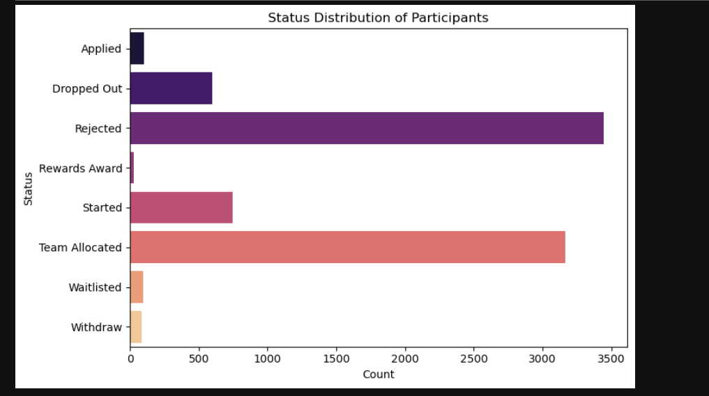
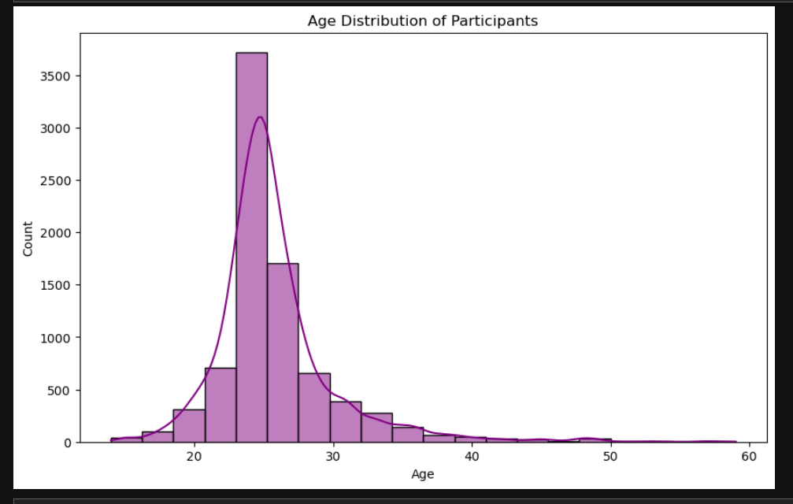
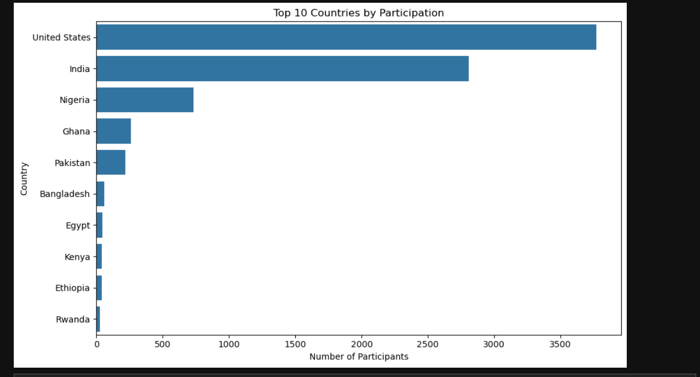
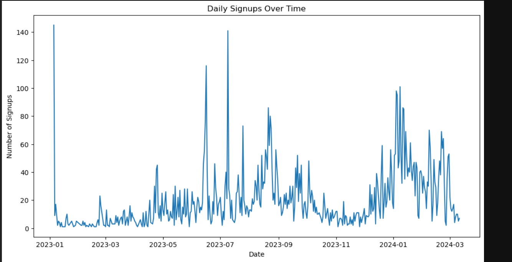
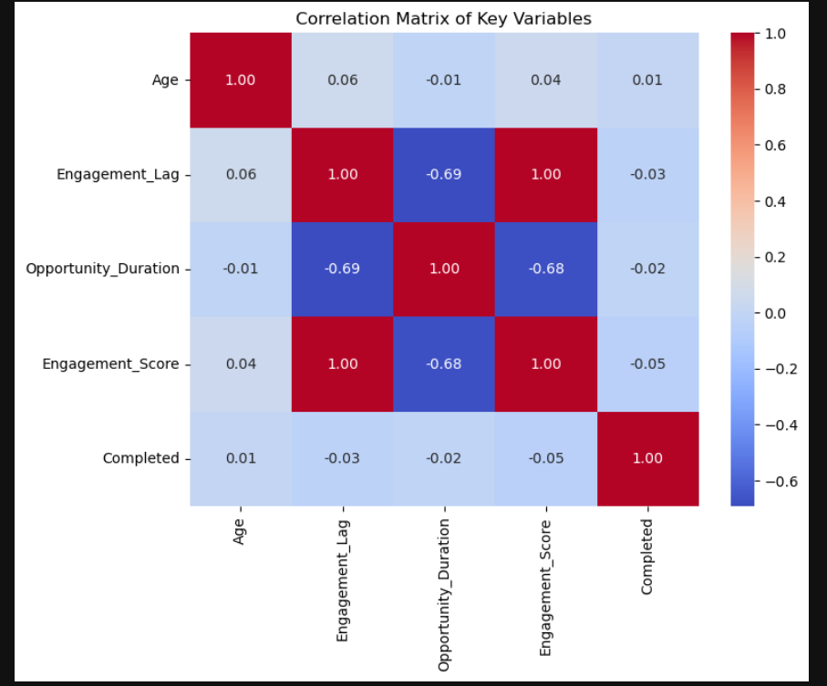
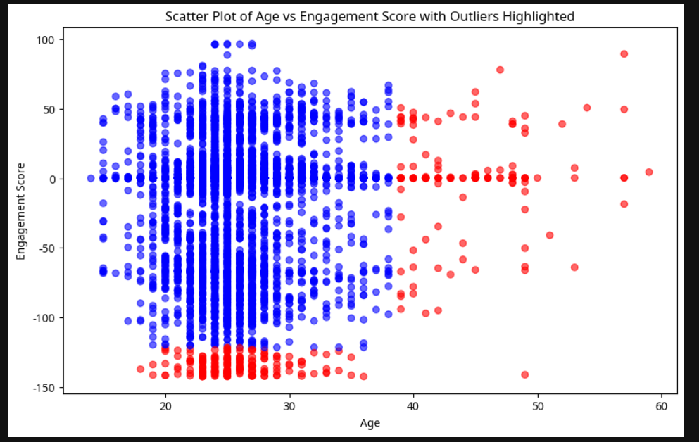

# 📊 Internship Data Analysis Project

This project explores engagement and completion behavior of users in an internship program. Using Python, the analysis covers data cleaning, exploratory data analysis (EDA), and visualization techniques.

---

## 🔍 Key Objectives

- 🧹 Clean raw user data for accuracy and consistency
- 📊 Perform statistical and pattern-based EDA
- 📈 Visualize trends and relationships using charts
- 🎯 Prepare a foundation for actionable insights

---

## 📁 Dataset Used

- **File:** `SLU_Opportunity_Wise_Data.csv`
- Contains data on participants, engagement metrics, demographics, and internship status

---

## ✅ Steps Completed

### 1. Data Cleaning
- Handled missing values
- Removed duplicates
- Ensured consistent data types

### 2. Exploratory Data Analysis (EDA)
- Created derived columns (e.g., `Completed`)
- Descriptive stats (mean, median, mode)
- Correlation matrix
- Outlier detection via Z-score

### 3. Visualizations
- Bar, Line, and Scatter plots implemented using Seaborn and Matplotlib

---

## 🖼️ Visual Results

### 📌 Status Distribution

### 📌 Gender Distribution

### 📌 Age Distribution

### 📌 Top Countries by Participation

### 📌 Daily Signups Over Time

### 📌 Correlation Matrix

### 📌 Scatter Plot with Outliers (Age vs Engagement Score)

---

## 📒 Notebook Preview

You can explore the full code, visualizations, and logic in:  
📘 [`Internship.ipynb`](Internship.ipynb)

---

## 🛠️ Tech Stack

- Python (Pandas, NumPy, Matplotlib, Seaborn, SciPy)
- Jupyter Notebook
- GitHub for version control and sharing

---

## 🚀 Future Scope

- Add insight extraction and business recommendations
- Apply clustering or predictive models
- Deploy dashboard or report on a web app (e.g., Streamlit, Power BI)

---

## 📬 Contact

Feel free to connect if you have feedback, suggestions, or collaboration ideas!

